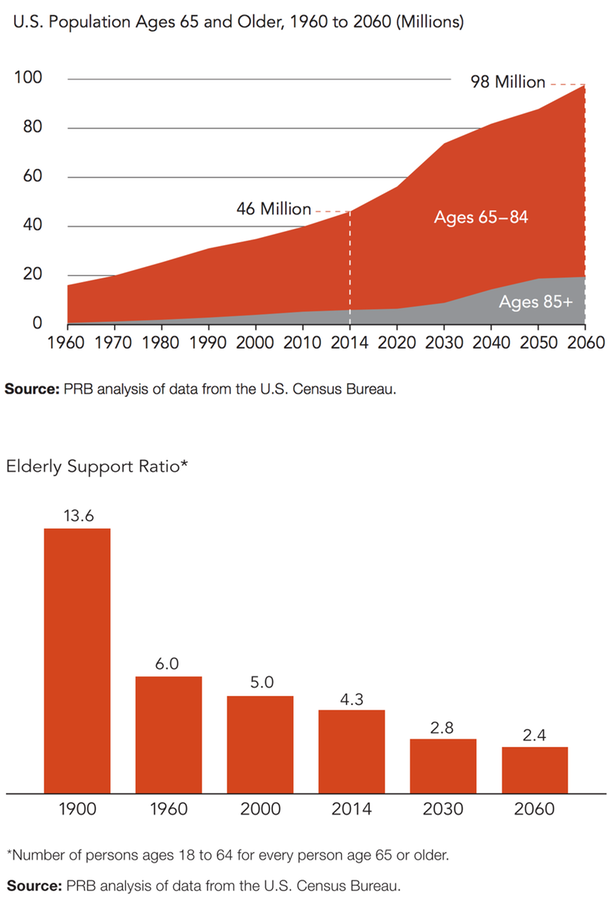
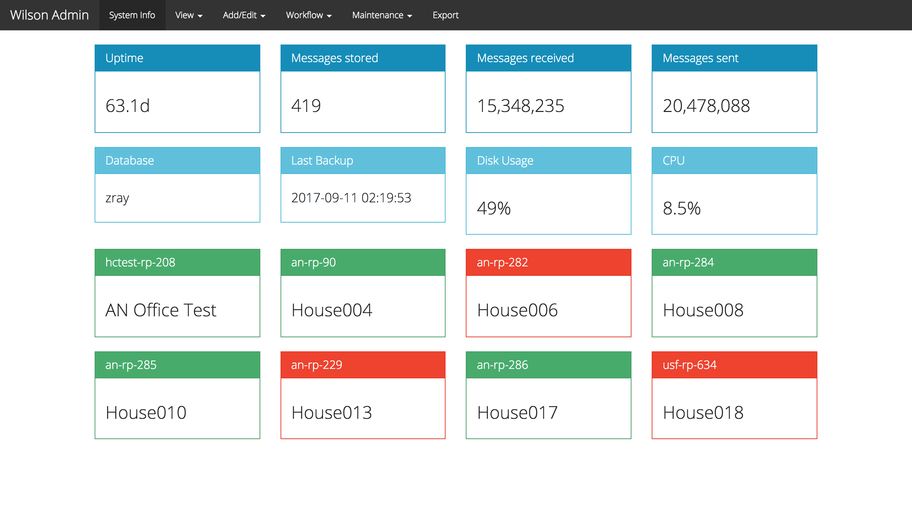
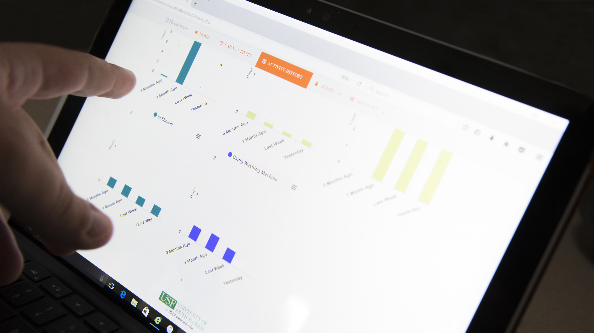
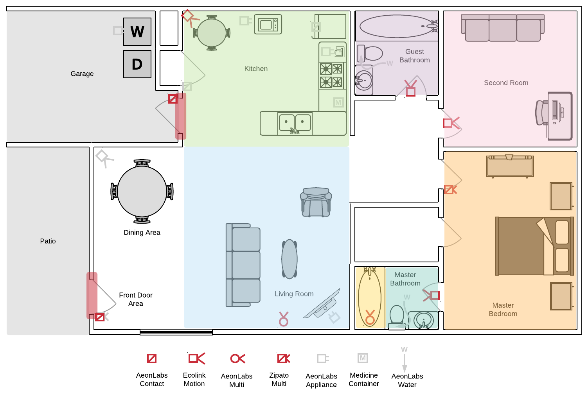
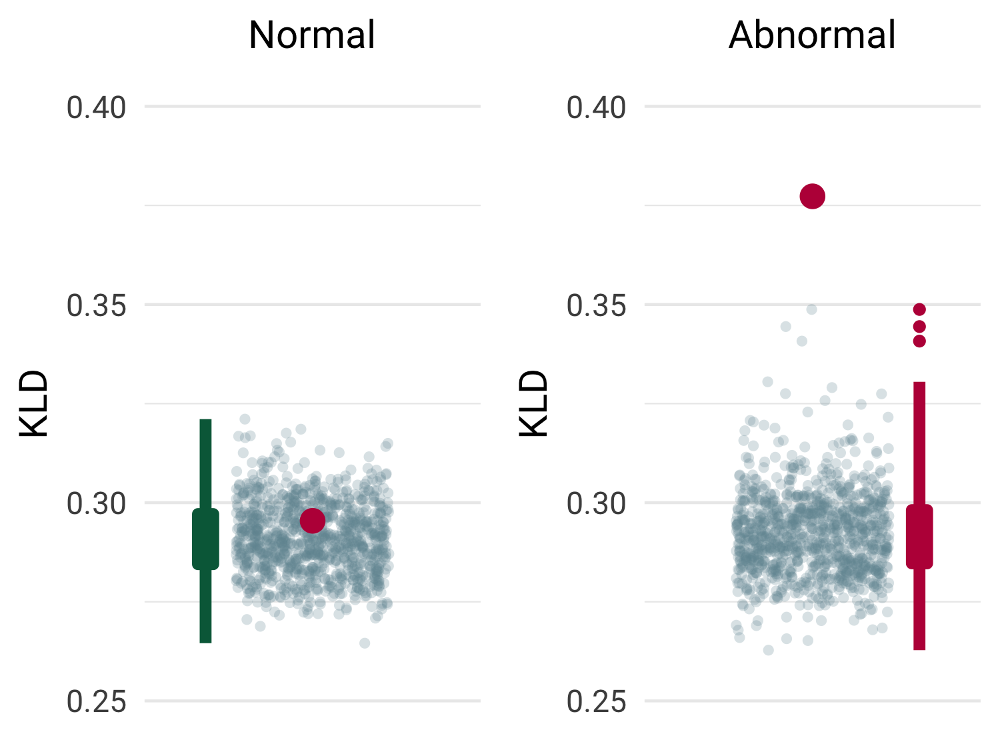
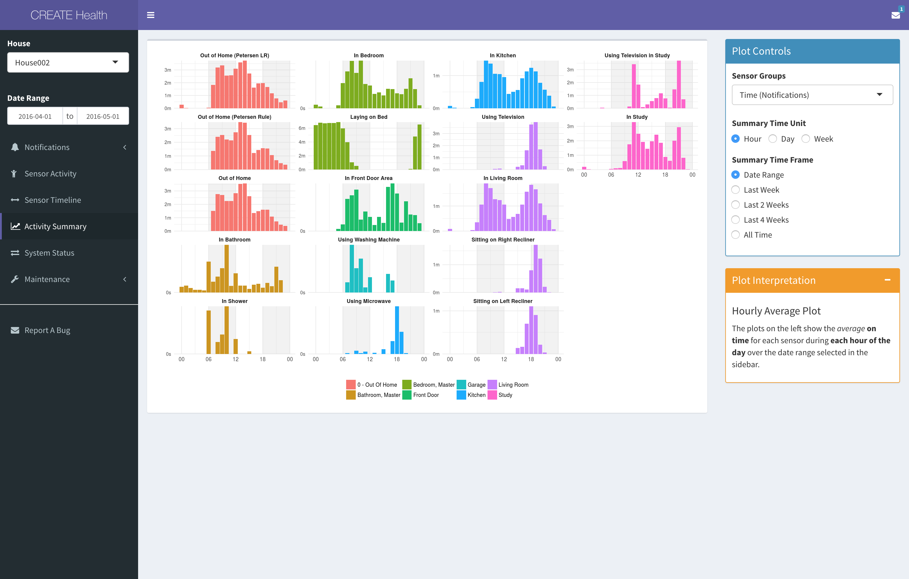
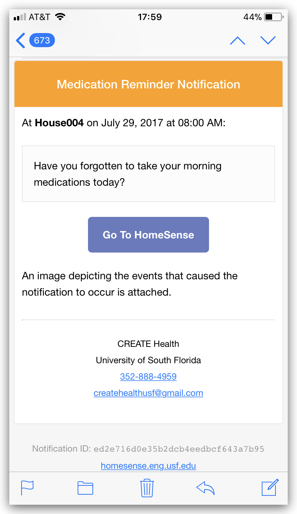

```{r setup, include=FALSE}
options(htmltools.dir.version = FALSE)
knitr::opts_chunk$set(echo = FALSE, results = "asis", 
                      cache = TRUE, warning = FALSE, message = FALSE, error = FALSE, 
                      fig.height = 7.5, fig.width = 10, fig.retina = 2)
library(tidyverse)
library(ap)

pkgs <- c("dplyr", "purrr", "stringr", "ggplot2", "simpleCache", "ap")
purrr::walk(pkgs, library, character.only = TRUE, warn.conflicts = FALSE, quietly = TRUE)
```

```{r import-data, include=FALSE}
# source(here::here('analyses/informs2017/informs2017-1-exp.R'))
NGRAM_MIN <- 2
NGRAM_MAX <- 6
load("~/Dropbox/USF/activityProfiles/data-cache/informs2017/dat.RData")
dat <- ret; rm('ret')
load("~/Dropbox/USF/activityProfiles/data-cache/informs2017/results.RData")
results_ap <- ret; rm('ret')

# setCacheDir("~/Dropbox/USF/activityProfiles/data-cache/ch6")
# simpleCache("dat_ch6_res_core")
houseXXX <- readRDS("~/Dropbox/USF/activityProfiles/data-cache/ch6/houseXXX.rds")
# load("~/Dropbox/USF/activityProfiles/data-cache/ch6/res_ch6_baseline.RData")
# res_baseline <- ret; rm('ret')
```

```{r xaringan-themer, include=FALSE, cache=TRUE}
library(xaringanthemer)
usf_green <- "#006747"
usf_gold  <- "#CFC493"
usf_gray  <- "#7E96A0"
usf_accent <- c("#DBE442","#9CCB3B","#009374","#29AFCE","#80B0A6","#7396A0","#006484","#466069")
duo_accent(
  text_font_google                = google_font("Roboto", "400", "300"),
  header_font_google              = google_font("Merriweather", "400", "300", "300i"),
  code_font_google                = google_font("IBM Plex Mono"),
  text_font_weight                = "400",
  text_font_size                  = "20px",
  code_inline_color               = "#222",
  text_slide_number_color         = "#555",
  inverse_header_color            = usf_green,
  inverse_background_color        = "#FFF",
  title_slide_text_color          = "#FFF",
  title_slide_background_color    = "#FFF",
  table_row_even_background_color = apply_alpha(usf_gold, 0.25),
  # title_slide_background_image    = "images/usf-bg-title.jpg",
  # title_slide_background_size     = "cover",
  # title_slide_background_position = "90% 90%",
  extra_css = list(
    ".remark-notes-area .remark-bottom-area .remark-notes-current-area" = 
      list(height = "80%"),
    ".remark-slide-number" = list(
      bottom = "5px",
      left = "45px",
      right = "0px"),
    ".no-slide-number > .remark-slide-number" = list(opacity = 0),
    ".remark-slide-content" = list(
      "background-image" = "url(images/usf-bg.jpg)",
      "background-size" = "cover",
      "padding-top"    = "75px",
      "padding-bottom" = "0px"),
    ".remark-slide-content.title-slide" = list(
      "background-image" = "url(images/usf-bg-title.jpg)",
      "background-size" = "cover"
    #   "background-position" = "90% 90%",
    #   "padding-top" = "0px"
    ),
   ".remark-slide-content h4" = list(
     color = usf_green,
     "font-size" = "1.1em",
     "margin-bottom" = "0"),
   ".title-slide h1" = list(
     "text-align" = "left",
     "position" = "absolute",
     bottom = "80px",
     left = "25px",
     "font-size" = "30px") ,
    ".title-slide h2" = list(
      "text-align" = "left",
      "font-size"     = "23px",
      "font-weight"   = "300",
      position = "absolute", bottom = "50px", left = "25px"),
    ".title-slide > h3" = list(
      "text-align"  = "left",
      "font-size"   = "20px",
      "font-weight" = "300",
      position = "absolute", bottom = "20px", left = "15px"), 
    ".remark-slide-content hr" = list(
      height = "2px",
      color = usf_gold,
      "background-color" = usf_gold,
      "border-radius" = "5px"),
    ".title-slide h3" = list("margin" = "10px"),
    ".inverse"        = list("font-weight" = "300"),
    ".inverse-text" = list("color" = usf_green),
    ".footnote" = list(
      color = "#466069",
      bottom = "2em"),
    ".pull-left p:first-child" = list("margin-top" = "0"),
    ".ngram-example code" = list(
      "font-size" = "1.5em",
      "word-wrap" = "break-word",
      color       = "#555"),
    "ul.words" = list("list-style" = "none"),
    ".words li, .word" = list(
      "font-family"      = "IBM Plex Mono, Monaco, monospace",
      "background-color" = "#eee",
      "padding-left"     = "8px",
      "padding-right"    = "8px",
      "margin-bottom"    = "6px",
      "width"            = "275px",
      "white-space"      = "nowrap",
      "border"           = "1px #aaa solid"),
    ".notes-list > ul" = list("list-style" = "none"),
    "li" = list("margin-bottom" = "0.4em"),
    "#table-results td, #table-results th" = list(
      "padding-left"  = "13px",
      "padding-right" = "13px")
  )
)
```

```{r refs, cache = FALSE}
refs <- c()
add_ref <- function(ref) {
  n_ref <- length(refs) + 1
  refs <<- c(refs, setNames(n_ref, ref))
  paste0("<sup>", n_ref, "</sup>")
}
library(RefManageR)
bib <- ReadBib("refs-isg2018.bib")
```
class: middle
exclude: true

<!-- LINKS 
[isg-2018]: https://www.sfu.ca/fc/ISG2018/
[xaringan]: https://github.com/yihui/xaringan
-->


## Outline

1. Introduction
    - CREATE Health
    - HomeSense

1. Activity Profiles

1. Behavior Change Detection

---
exclude: true

## Overview

1. Intro
    - Our study focuses on addressing X (one slide)
    - Study participants (one slide)
    - Research objective
1. System
    - Sensors, placement, etc.
1. Activity Profiles
    - Day-event sequences and bag-of-event *n*-grams
    - How are APs compared?
    - Occupant identification task: experiment and results
1. Behavior Change Detection


---
background-image: url(images/create_health.png)
background-size: 100%
background-position: 50% 50%
name: create-health
class: bottom, center

???

Who are We?

Collaborative for Research & Education<br>
in Aging, Tech & Health

- Community Partners, Funders, Academics, Students from a variety of disciplines

- supported and connected by USF

-  with a focus on improving health and qol of life in late life

---
exclude: true

<!-- My CREATE Health Slide -->

.big[
<br><br>
`usf.edu/engineering/create-health`<br><br>
]

???

CREATE Health 
- is an **interdisciplinary team** 
- of ENG & PUB HEALTH students & researchers
- dedicated to improving the health and quality of life of aging populations
- through the use of technology

CH's research focuses on 
- alleviating the burdens, financial and physical, of chronic disease treatment 
- by examining how technology can improve healthcare delivery and support, 
- in particular at the intersection of community and organizational health system components.

---
layout: false
name: villages
class: bottom, center, bg-full, no-pad, no-slide-number
<!-- background-size: cover -->
<!-- background-image: url(images/villages-flyover.png) -->

<video loop muted autoplay poster="images/villages-flyover.png" class="bg-video">
    <source src="images/villages-flyover2.mp4" type="video/mp4">
</video>

.box-center-bottom.box-light[


<div style="text-align: left; padding-left: 60px">
<ul>
<li>The largest retirement community in US</li>
<li>75 miles north of Tampa, FL</li>
<li>115,000 residents in 50,000 homes</li>
<li>Average age: 62 (M) and 60 (F)</li>
<ul>
</div>
]
<!-- <div style="padding: 15px">&nbsp;</div> -->

???
A majory community partner in CREATE Health's work is The Villages...

.notes-list[
- 32 sq miles
- 3 town squares
- 63 rec centers
- legend has it a Villager can play 18 holes of gold for 30 straight days without repeating
]

---
class: bottom center no-slide-number
background-image: url(images/participant-seated.jpg)
background-size: cover
layout: true
---
count: false

???

- I'd like to introduce you to one of the participants in our study, who I will 
  call **Dorothy**.
- Dorothy is between 75 and 80 years old, she's divorced, and she lives alone 
  in her home in The Villages.
- Overall, she's in great health. 
- As a typical retiree living in the Sunshine State, she leads a highly active 
  life involving 
      - an assortment of clubs and groups, 
      - dance classes at the recreation center, and 
      - frequent lunches and dinners in the town square with friends.
- She lives alone, but she talks to her daughter regularly, even though they live
  on opposite sides of the US.

---
count: false

???

- About a year or so ago, though, Dorothy's **recurrent hip pain** worsened and she and 
  her doctor decided for **hip replacement surgery**.
- She arrived at the hospital on the day of the procedure only to find out that due 
  to an insurance issue, she would have to wait another three months.
- In the mean time, 
    - her mobility declined, 
    - she spent more time in bed, and 
    - she couldn't make it to many of the activities she loved.
- Her daughter had planned to visit during this time, but due to a family 
  emergency she had to cancel her plans.
- In the end surgery went well, Dorothy recovered quickly and a few months later
  she was back to living the life she enjoyed.


---
layout: false
.pull-left[
### Aging in Place

- Americans 65+ will **double** from 2014 to **98M** in 2060`r add_ref("Mather2015")`

- 80% manage one or more<br>chronic conditions`r add_ref("Pearson2012")`

- Decrease in available traditional family caregivers`r add_ref("Demiris2008a")`

- Strong preference to<br>**age in place**
]

.pull-right[

]

.footnote.small[
`r refs["Mather2015"]`: `r Citet(bib, "Mather2015")` <br>
`r refs["Pearson2012"]`: `r Citet(bib, "Pearson2012")` <br>
`r refs["Demiris2008a"]`: `r Citet(bib, "Demiris2008a")`
]

???

.notes-list[
I'm sharing Dorothy's story for __2 reasons__: The first because... __her experience highlights the challenges__ we face as a society in how we approach aging and manage health care for older adults.

1. She is part of a __growing population of seniors__, one that is expected to double to 98M over the next 40 years

2. __Life expectancy has increased by 3 mon/year since 1840<sup>*</sup>__ 
  - and while 75% of seniors report being in __good to excellent health__, 
  - __a majority are managing chronic health conditions__.

3. More older adults are divorced or live alone than ever before, which in conjunction with demogrph. changes leads to decreased availability of traditional family caregivers

4. Additionally, there is a strong preference to age in place, __like Dorothy__ -- remain in their own homes and communities, for as long as possible (75% want to stay, vast majority 96% live in community)
]

<!-- .footnote.small[<sup>*</sup>Wouters 2017] -->

---
layout: false
background-image: url(images/participant-pointing-sensor.jpg)
background-size: cover
class: right middle no-slide-number

.box-right.box-light[
# HomeSense
]

???

The second reason I've shared Dorothy's story is because, 
- as a participant in our study, 
- she had a home sensor system installed in her home 
- and that system allowed Dorothy's daugher to stay in touch with her mother's daily activities while they waited 4 hip replace

The goal of the system that we call __HomeSense__ 
- is to support seniors who want to age in place safely and independently
- by monitoring daily activities
- in particular focusing on the activities that signal or influence health outcomes


---

### The HomeSense System

.pull-left[
.mt-3[

]


<!-- .bigger.center[
<i class="fas fa-bolt" style="color: #FFC107"></i><br>
<i class="fas fa-database" style="color: #28A745"></i>&nbsp;
<i class="fas fa-table" style="color: #17A2B8"></i>&nbsp;
<i class="fas fa-bell" style="color: #DC3545"></i>
] -->
]

.pull-right[


]

???

The main compenents of the system are
- wireless sensors installed throughout the home
    - **presence**: PIR motion sensors in all commonly used areas
    - **magnetic contact sensors**: doors, cabinets, fridge access
    - **other**: electricity, temp, luminance, etc.
- the data is collected through raspberry pi in home<br>
  ...then collected, warehoused and processed on our servers
- A suite of tools for internal use such as 
    - a custom inventory management system and 
    - a number of dashboards
- A web interface for users and family/friends<br>
  can review summarized and detailed activity data

---
class: bottom center no-slide-number
background-image: url(images/participant-smiling-computer.jpg)
background-size: cover

.box-bottom.box-light.big[_I like the idea that my kids feel really secure, knowing that I’m on the other side of the country._]

???

When asked about her experience with HomeSense, Dorothy said...

---
class: bottom center bg-full no-slide-number
background-image: url(images/participant-computer-pointing.jpg)
count:false

.box-bottom.box-light.big[_This is a great non-intrusive system<br>that makes me at ease, makes my family and <br>I feel more safe and connected._]

???

This really summarizes the potential impact of a system like HomeSense in terms of the sense of security and reassurance that it provides to older adults and their caregivers.

---

### Lifestyle Reassurance

- Alleviate burden of chronic illness with supportive technology<sup>`r refs["Demiris2008a"]`</sup>

- Provide safety and security around changes in health and routine

???

This need for safe aging in place is reflected in our design goal
of supporting **lifestyle reassurance**.

Our objective is to develop supporting technologies such as HomeSense to
alleviate the burden of chronic illness on OA & CGs

A primary goal of such a system is to support safety and security 
by noticing changes in behavior and routine and alerting 
OA/CGs when these occur

--

### Unsupervised Behavior Change Detection

- Labelled activity data is difficult and expensive to collect`r add_ref("Szewcyzk2009-Annotatingsmartenvironment")`

- Requires solutions without explicit, higher-level activity labels

- Reflects real-world, natural, smart home activity data

.footnote[
`r refs["Demiris2008a"]`: `r Citet(bib, "Demiris2008a")`; 
`r refs["Szewcyzk2009-Annotatingsmartenvironment"]`: `r Citet(bib, "Szewcyzk2009-Annotatingsmartenvironment")`
]

???
<hr>

OTOH, because labelled activity data 
is difficult and expensive to collect –<br>
especially natural patterns of Daily Living –<br>
we need an approach that does not require
explicit, high-level activity labels
and that can effectively make use of real-world, natural SH act. data

---
name: research

### Research Objective

.big[
>_Can we effectively use passively-recorded
unlabelled sensor data
to characterize lifestyle
activity patterns and enable
detection of changes in routine?_
]

???

To summarize, our research objective is centered on the question...

We will address this question from two angles:

1. Defining *lifestyle activity pattern*

2. Using the AP for behavior change detection

Over the next few slides, we'll touch briefly on<br>
the sensor system and the data that we collected<br>

Then I'll explain our definition of *activity profiles*
and present the results of an experiment to demonstrate
that these activity profiles capture the unique behavior 
of the occupant.

Finally, we'll discuss the method and results of the 
algorithm for behavior change detection.

---
layout: true
### Activity Profiles

???

*Faux-animated slides*

- Explain how sensor events are used, divided, processed
- Given example of sensor events
- String representation simply encodes a series of actions
- To get bag of n-grams, take sliding window across event series
- Gather and count each n-gram

---

- Concise representation of sensor activities

- Allow comparison between activities at different time points or occupants

--

<br>

Represent sensor events as daily *event sequences*

1. Use only **active** sensor firings grouped by day

1. Day begins at first 5 active events after 4 a.m.

1. Insert *pause event* when no activity in 15 minutes

1. Summarize event sequence as **bag-of-event _n_-grams**`r add_ref("Hamid2005")`

.footnote[
`r refs["Hamid2005"]`: `r Citet(bib, "Hamid2005")`
]

---

```{r ngram-example-1}
example_sequence <- "IiIAEFfFfA0AE0EGAgEAIiIAEIiIiOiIGAgEIIIAE0AE0AEAAE0A0AAEIiIFfFfAEA0AEAE0AEEAAEAEAA0AIiI0AEIiI0IIiI0"
example_sequence <- "IiIAEFfFf0AE0AIiiOIiIA0AEGg0GAgEIiIA0AEAA0A0AGgE0A0AEAEA0AFfIiIIEAFGgAf0FfAIiIA0AE0AEIiII0IiI0"

cat(".ngram-example[", "<code>", example_sequence, "</code>", "]", sep="\n")
```

---

```{r ngram-example-2, include=FALSE}
dict <- dat$House003$dictionary
dict <- c(dict, "Pause" = "0")
example_actual <- ap:::decode(str_split(example_sequence, "")[[1]], dict)
example_actual <- str_replace(example_actual, "!Opened", "Closed")
example_actual <- str_replace_all(example_actual, "(\\w)([A-Z])", "\\1 \\2")
# cat('<ul class="words">',
#     paste0("<li>", example_actual[1:10], "</li>"),
#     "</ul>"
# )
cat('<p style="line-height: 2.5em">', 
    paste0('<span class="word">', example_actual[1:10], "</span>", 
           c(rep("\n--\n", 5), rep("", 5)), 
           collapse = " \U27A1 "),
    "</p>")
```

```{r emoji-example}
replace_name <- function(x, name, new_name) {
  names(x)[which(names(x) == name)] <- new_name
  x
}
highlight_letters <- function(x, i, j) paste0(
  if (i > 1) substring(x, 0, i-i), ".hl-text[", substring(x, i, j), "]", substring(x, j+1, nchar(x))
)
emojdict <- dict %>% 
  # replace_name("InLivingRoom", "\U1F6CB") %>% 
  # replace_name("InKitchen", "\U1F37D") %>% 
  # replace_name("InBathroomMaster", "\U1F6C1") %>%
  # replace_name("InBedroomMaster", "\U1F6CF") %>% 
  replace_name("InLivingRoom", '<i class="fas fa-couch" style="color: #DBE442"></i> ') %>% 
  replace_name("InKitchen", '<i class="fas fa-utensils" style="color: #9CCB3B"></i> ') %>% 
  replace_name("InBathroomMaster", '<i class="fas fa-bath" style="color: #006484"></i> ') %>%
  replace_name("InBedroomMaster", '<i class="fas fa-bed" style="color: #29AFCE"></i> ') %>% 
  replace_name("!OpenedFrontDoor", '<i class="fas fa-sign-in-alt" style="color: #a97a7a"></i>&nbsp;') %>% 
  replace_name("OpenedFrontDoor", '<i class="fas fa-sign-out-alt" style="color: #009374"></i>&nbsp;') %>% 
  replace_name("Pause", '<i class="fas fa-pause-circle" style="color: #466069"></i>')
example_actual <- ap:::decode(str_split(example_sequence, "")[[1]], emojdict)
for (i in 1:10) {
  if (i %in% c(6, 8)) next
  cat("count: false\n\n")
  cat(".ngram-example[", "<code>", highlight_letters(example_sequence, 1, i), "</code>", "]", sep="\n")
  cat('<p class="huge" style="line-height: 1.5em">', 
      if (i <= 5) example_actual[1:i] else paste0(c(example_actual[1:5], "<br>", example_actual[6:i])),
      "</p>\n\n---\n\n")
}
```

```{r ngram-example-repeat}
cat(".ngram-example[", "<code>", example_sequence, "</code>", "]", sep="\n")
```

---

```{r ngram-example-sliding}
length_ngram <- 5
ngrams <- c()
for (i in 1:7) {
  ngram <- substr(example_sequence, i, i+length_ngram-1)
  ngrams <- c(ngrams, ngram)
  cat(sep = "",
    "count: false\n\n",
    ".ngram-example[\n<code>",
    substr(example_sequence, 0, i-1),
    ".word.hl-text.hl[",
    ngram,
    "]",
    substr(example_sequence, i+length_ngram, nchar(example_sequence)),
    "</code>\n]", 
    if (i == 1) "\n\n--\n\n",
    "&nbsp;&nbsp;&nbsp;&nbsp;.big[\U2B07]",
    if (i == 1) "\n\n--\n\n",
    if (length(ngrams)) paste0("\n\n#### Bag of event n-grams\n\n.word[", paste(ngrams, collapse = "] .word["), "]"),
    # if (length(ngrams)) paste0("\n\n**Bag of n-grams:**\n\n<ul class=\"words\"><li>", paste(ngrams, collapse = "</li><li>"), "</ul>"),
    "\n\n---\n\n")
}
```

.pull-left[
**Bag-of-event n-grams**

- Repeat process for $n$ from `r NGRAM_MIN` to `r NGRAM_MAX`

- Calculate relative frequency $p$ of each $n$-gram

- Can be used to summarize $m$ days

**Compare two profiles**

- Using Kullback-Leibler Symmetric Distance

- $D_{KL} (P \Vert Q) = 0.331$
]

.pull-right[
```{r ngrams-table}
ngramify_freq(example_sequence, NGRAM_MIN, NGRAM_MAX) %>% 
  mutate(ngram = glue::glue("<span class='word'>{ngram}</span>")) %>% 
  slice(1:10) %>% 
  knitr::kable(format = "html", digits = 4, escape = FALSE,
               align = "cccr",
               col.names = c("n-gram", "Count", "Rank", "Freq."))
```
]

???

***

KL Distance provides a distance measure between probability distributions.

We use KL dist to compare frequencies across b-o-e n-grams (activity profiles)

$D_{KL} (P \Vert Q) = \sum_{i} \left( p_i - q_i \right) \log \frac{p_i}{q_i}$

---
layout: true
### Evaluating Activity Profiles
---

*Do activity profiles capture the occupant's unique patterns?*

--

#### Reframe as supervised learning

*Can we identify the correct occupant for a de-identified day of activity?*

???

Also: If we're creating a baseline profile, how many days are needed?

---

#### Data Collection

**HomeSense** was installed in the homes of
- community-dwelling older adults in The Villages, FL
- who live alone and were of good health

Bi-weekly phone survey tracks health changes, significant life events

???

Read slides...

14 participants, aged 68+

--

#### Data Selection for Activity Profiles

Selected 6 participants:

- homes with similar floorplan & sensor layout

- who completed at least 196 days
    - Excluding vacation, maintenance visits, guests & visitors

???

Because sensor installations varied according to floorplan
we selected a subset of participants with longterm participation
and standard sensor layouts.

---
background-image: url(images/simple-exp-covered.png)
background-size: 96%
background-position: 20% 50%
exclude: true
---
layout: false

### Floorplan and Sensor Layout



???

Included in the sensor network
- motion sensors for the generalized detection
of presence throughout the home
- magnetic contact sensors for detection of
interaction with entrance and exit doors and routinely used objects
- wireless, z-wave


---
### Evaluating Activity Profiles

#### Experimental Setup

- Create **activity profile** for each occupant from *N* days
    - *N* — 14 days to 3 months
    
- Label test day with occupant of best activity profile match

- 7-fold cross validation
    - Test on each of **28 testing days**
    - Profiles drawn from remaining **168 training days**

???

Note, because profiles drawn from 168 training days, 
I repeatedly draw from training pool so that all folds
have 12 trial total (12 iters, 1 rep -- 2 iters, 6 reps)

---
layout: false

### Results: Activity Profiles

```{r results-ap-table}
day_names <- colnames(results_ap$summary_overall_final)[-1]
day_names <- sub(" ", "<br>", day_names)
results_ap$summary_overall_final %>% 
  mutate_if(is.numeric, function(x) {
    x <- sprintf("%0.3f", x)
    paste0(
      '<span style="color: #555;">',
      substr(x, 1, 3), 
      "</span><span style=\"font-weight: normal\">", 
      substr(x, 4, 5), 
      "</span>")
  }) %>% 
  column_to_rownames("metric") %>% 
  knitr::kable(
    format="html",
    col.names = day_names,
    align = "r",
    table.attr = 'id="table-results"',
    escape = FALSE)
```
<br>


```{r results-ap, fig.height=2.5}
results_ap$summary_overall %>% 
  filter(metric == "f1") %>%
  group_by(metric, model) %>%
  summarize(value = mean(value)) %>%
  ungroup() %>%
  mutate(
    days = str_replace(model, "days", ""),
    days = as.integer(days),
    metric = "F-Measure"
  ) %>% 
  {
    ggplot(.) +
      aes(x = days, y = value) + 
      geom_point(size = 3, color = usf_green) +
      geom_line(size = 1.25, alpha = 0.5, color = usf_green) +
      guides(color = FALSE) +
      ylim(0.85, 1) +
      scale_x_continuous(
        breaks = seq(14, 84, 14),
        minor_breaks = seq(14, 84, 7)) +
      labs(x = "Days in Profile", y = "F-Measure") +
      theme_minimal(20, "Roboto") +
      theme(
        panel.grid.minor.y = element_blank())
  }
```

???

Note 42d (6w) maximizes performance across the board

Plotting **F Measure** (F1): balance of precision and recall

(balanced measure of binary classification)

28-42 days ok (4, 6 wk)

---
count: false
exclude: true

```{r results-ap-ungrouped, fig.height=3.5}
g <- results_ap$summary_overall %>% 
  filter(metric == "f1") %>%
  # group_by(metric, model) %>% 
  # summarize(value = mean(value)) %>% 
  # ungroup() %>% 
  mutate(
    days = str_replace(model, "days", ""),
    days = as.integer(days),
    metric = "F-Measure"
  ) %>% 
  {
    ggplot(.) +
      aes(x = days, y = value) + 
      geom_point(aes(color = house_name), size = 2.) +
      geom_line(aes(color = house_name), size = 1.25, alpha = 0.5) +
      guides(color = FALSE) +
      ylim(0.85, 1) +
      scale_color_manual(values = usf_accent[-1])+
      scale_x_continuous(
        breaks = seq(14, 84, 14),
        minor_breaks = seq(14, 84, 7)) +
      labs(x = "Days in Profile", y = "F-Measure") +
      theme_minimal(20, "Roboto") +
      theme(
        panel.grid.minor.y = element_blank())
  }
g
```

---
count: false
exclude: true

```{r results-ap-sel, fig.height=3.5}
g + annotate("rect", xmin = 39, xmax = 45, ymin=-Inf, ymax=Inf, fill = usf_gray, alpha = 0.3)
```

---
layout: true
### Behavior Change Detection

```{r behavior-change-settings}
OVERALL_N_DAYS <- c(7, 14, 28, 56)
BS_ITERS <- 1000
# OVERALL_N_DAYS <- c(7, 28)
BS_ITERS <- 100
used_dictionary <- ap:::dictionary_global
SINGLE_PAUSE <- TRUE
```

- Compare occupant's recent activity to previous behavior
    - 4 participants with 1+ years data
    - Using all binary, active sensors

- Permutation-based methods for change detection<sup>`r add_ref("Sprint2016-swPCAR")`</sup>

.footnote[
`r refs["Sprint2016-swPCAR"]`: `r Citet(bib, "Sprint2016-swPCAR")`
]

???

- Having validated that the activity profiles are capable<br> 
  of summarizing the activity patterns of an occupant,<br>
  we now turn to the task of behavior change detection

- compare occupant's recent activity to previous behavior<br>
  previous behavior is either a baseline period of normalcy<br>
  or sliding windows

- Given that KL-dist is a scale-less distance metric,<br>
  need to establish bounds guidelines for expected similarity
  *What is normal variation vs. anomaly/change?*

- Overall, our goal is to bring abnormalities to the attention of caregiver<br>
  human review and intervention is expected<br>
  and system issues are equally requiring of attention

---

--

```{r permutation-setup}
plot_day_examples <- function(ws, shuffle = FALSE, bottom = TRUE) {
  if (shuffle) {
    stopifnot(length(unique(ws$label)) == 2)
    w1 <- sample(0:1, nrow(ws)/2, replace = TRUE)
    w2 <- 1 - w1
    ws$label <- unique(ws$label)[c(w1, w2) + 1]
  }
  ws <- bind_rows(ws,
    data_frame(
      label = c("W1", "W2"),
      x = paste0("W", 1:2),
      y = c(-0.25, -0.25)
    )
  )
  if (shuffle) ws$x <- c("W1" = "W*1", "W2" = "W*2")[ws$x]
  ws$label <- factor(ws$label, c("w1", "w2", "W1", "W2"))
  g <- ggplot(ws, aes(y, x, fill = label, color = label)) + 
    geom_tile(width = 0.9, height = 0.9, color = "black") + 
    geom_vline(xintercept = 0.375, color = 'black', size = 1) +
    # geom_hline(yintercept = 0.40, color = "black", size = 1, arrow = arrow(length = unit(0.03, "npc"))) +
    coord_equal() + 
    guides(fill = FALSE) + 
    labs(x = "Days", y = "") + 
    # ylim(-0.75, 10.5) +
    scale_x_continuous(limits = c(-0.75, 22), expand = c(0,0))+
    scale_y_discrete(expand = c(0, 0.8)) +
    # scale_fill_manual(values = c(
    #   "#7FB1C1", # lighten_color(usf_accent[7], 0.5)
    #   usf_accent[c(5, 7, 3)])) +
    scale_fill_manual(values = c("#fdbf6f", "#a6cee3", "#ff7f00", "#1f78b4")) + 
    theme_minimal(23) + 
    theme(
      plot.margin = margin(0, 1, 0, 0),
      panel.grid = element_blank(), 
      # axis.line.x = element_line(colour = 'black'),
      axis.text.x = element_blank(),
      axis.title.x = element_text(size = 18)
    )
  if (bottom) g +
    geom_segment(data = data_frame(x = 0.375, xend = 21.5, y = 0.1, yend = 0.1, label = "W1"),
                 aes(x = x, xend = xend, y = y, yend = y),
                 color = "black", size = 1.25,
                 arrow = arrow(length = unit(0.2, "npc"))) +
    labs(x = "Days", y = "")
  else g + labs(x = "", y = "")
    
}

ws <- data_frame(
  label = c(rep("w2", 10), rep("w1", 10)),
  x = c(rep("W2", 10), rep("W1", 10)),
  y = 1:20
)
```

```{r permutation-plots, dependson="permutation-setup", fig.height = 3}
permuted_plots <- list()
set.seed(43)
for (i in 1:4) {
  permuted_plots[[i]] <- plot_day_examples(ws, i > 1, i %in% c(1, 4))
}
cowplot::plot_grid(permuted_plots[[1]], ncol = 2)
cat("\n\n---\n\n")
cowplot::plot_grid(
  permuted_plots[[1]], 
  cowplot::plot_grid(plotlist = permuted_plots[-1], ncol = 1),
  ncol = 2, axis = "t")
```

---
layout: true
### Permutation-Based Comparison
---

```{r comparing-distances, fig.height=7, include=FALSE}
left_date = "2017-10-01"
right_date = "2017-12-15"

jitter <- function(df, var) {
  var <- enquo(var)
  jit <- runif(length(df[[rlang::quo_text(var)]]), -0.125, 0.125)
  jit[which(df$iter == 0)] <- 0
  mutate(df, end = end + jit)
}

filter_and_jitter <- function(df, date) {
  df %>%
    filter(end == lazydate(date)) %>%
    mutate(end = as.integer(strftime(end, "%j"))) %>%
    jitter(end)
}

plot_iters <- function(df, i, lab.x = "Normal", lab.y = "KLD", add_boxplot = FALSE) {
  xmin <- min(df$end)
  xmax <- max(df$end)
  xend <- df %>% filter(iter == 0) %>% pull(end)
  df <- filter(df, iter >= 1000 - i)
  g <- ggplot(df) +
    aes(y = dist, x = end, group = end)
  if (add_boxplot) g <- g + geom_boxplot(aes(x = as.integer(!!xend)))
  g +
    geom_point(data = filter(df, iter != 0), alpha = 0.25, color = usf_accent[6], shape = 16) +
    geom_point(data = filter(df, iter == 0), color = '#BB1847', size = 4, shape = 16) +
    theme_minimal(14, "Roboto") +
    theme(
      axis.text.x = element_blank(),
      axis.ticks.x = element_blank(),
      panel.grid.major.x = element_blank(),
      panel.grid.minor.x = element_blank()
    ) +
    labs(x = lab.x, y = lab.y) +
    scale_x_continuous(limits = c(xmin - 0.15, xmax + 0.15),
                       expand = c(0,0), position = "top") +
    ylim(.25, .4)
}
single_plot <- function(i, ...) {
  cowplot::plot_grid(
    plot_iters(m28_left, i, "Normal", ...),
    plot_iters(m28_right, i, "Abnormal", ...),
    ncol = 2,
    align = 'h'
  )
}

set.seed(42)
m28_left <- filter_and_jitter(houseXXX$moving_28, left_date)
m28_right <- filter_and_jitter(houseXXX$moving_28, right_date)
```

.center[

]

???

Each shuffling of 

---

.center[

]

---
layout: false

```{r moving-window-plots, warning = FALSE, include=FALSE, eval=FALSE}
plot_all_moving_by_house <- function(
  x, house = c("House004", "House005", "House008", "House013"),
  mask_date = FALSE,
  mask_house = FALSE
) {
  house <- match.arg(house)
  x <- map(c(7, 14, 28), 
      function(w) {
        m <- paste0("moving_", w)
        w <- paste0("Window: ", w/7, " week", if(w/7 > 1) "s")
        g <- plot_summarized_window(dat_ch6_res_core[[house]][[m]], FALSE) + 
          ggtitle(paste(w, if (!mask_house) paste0(" (", house, ")"))) + 
          theme_minimal() + 
          theme(
            panel.grid.minor = element_blank(),
            panel.border = element_rect(fill = NA, color = "grey70")
          )
        if (!mask_date) return(g)
        g + theme(axis.text.x = element_blank()) + labs(x = "")
      })
  cowplot::plot_grid(plotlist = x, ncol = 1)
}

for (h in c("House004", "House005", "House008", "House013")) {
  cat("count: false\n\n.full-plot[\n")
  print(plot_all_moving_by_house(dat_ch6_res_core, h, FALSE, FALSE))
  cat("\n]\n\n---\n\n")
}
```

### Results: Behavior Change

```{r behavior-change-house013, warning = FALSE, fig.height=6}
plot_summarized_with_highlights <- function(dfm, 
                                            adjust_days = 14, window_days = max(adjust_days, 7), 
                                            just_max_data = FALSE, mask_date = FALSE) {
  pdates <- as.list(dfm %>% summarize(min = min(start), max = max(end)))
  
  df_max <- dfm %>% 
    summarize_window() %>% 
    ungroup() %>% 
    mutate(
      end = end - days(adjust_days),
      max_run = zoo::rollmax(value, window_days, fill = 0, align = 'c'),
      local_max = value == max_run
    ) %>% 
    filter(local_max, outlier)
  if (just_max_data) return(df_max)
  
  g <- dfm %>% 
    summarize_window() %>% 
    ungroup() %>% 
    mutate(end = end - days(adjust_days)) %>% 
    {suppressWarnings(plot_summarized_window(.))} +
    geom_point(data = df_max, aes(x = end, y = value), size = 5, color = "#20ac20", alpha = 0.6, shape = 16) +
    theme_minimal(18) + 
    theme(
      panel.grid.minor = element_blank(),
      panel.border = element_rect(fill = NA, color = "grey70")
    )
  if (!mask_date) return(g)
  g + 
    scale_x_datetime(limits = c(pdates$min, pdates$max), date_labels = "%b", date_breaks = "3 month") + 
    labs(x = "")
}


cowplot::plot_grid(
  plot_summarized_with_highlights(houseXXX$moving_14, 7, 14, mask_date = TRUE) +
    ggtitle("2 Week Sliding Windows"),
  plot_summarized_with_highlights(houseXXX$moving_28, 14, 28, mask_date = TRUE) +
    ggtitle("4 Week Sliding Windows"),
  nrow = 2,
  align = 'v'
)
```

???

- **June** (05-31 -- 06-27)
    - June 20XX was an odd month, due to company in home
- **Late June, Early July** (06-19 -- 07-16)
    - Back to normalcy
- **August** 08-01 -- 08-28
    - System wide change in data collection
- 10-21 -- 11-17
    - ??
- **December** (12-04 -- 01-02)
    - Company in home all of December
- **January** (01-03 -- 02-20)
    - Reduction in mobility leading up to surgery
- **Late February** (03-24 -- 04-20)
    - Post surgery
- **Late April** (04-21 -- 05-18)
    - Post recovery
- **November** (11-09 -- 12-06)
    - Holidays

---

.pull-left[
### Looking Forward

- Early alerting of caregivers or admin through dashboard or notifications

- Couple behavior change with comparison to **baseline**

- Use permutations to<br>**explain differences**`r add_ref("Ribeiro2016-WhyShouldTrustYou")`
]

.pull-right.center[


]

.footnote[
`r refs["Ribeiro2016-WhyShouldTrustYou"]`: `r Citet(bib, "Ribeiro2016-WhyShouldTrustYou")`
]

???

.notes-list[
- This work can be integrated into a dashboard or notification system
  so that caregivers or admin can be alerted early as behavior patterns shift,
  triggering more careful monitoring
  
- The method for behavior change identification works best on longer-term time horizons --
  i.e. previous month was *unusual* -- but can be coupled with a comparison
  to a baseline period, leading to more fine-grained comparison of
  daily behaviors.
  
- The permutations-based method will be extended to provide more information
  about the differences between windows, by looking at the contribution of
  individual days, hours, or even event sequences over the various permutations.
  **Local Interpretable Model-Agnostic Explanations (LIME)**
]

---
name: closing
background-image: url(images/usf-closing.jpg)
class: middle right white no-slide-number

.bigger[Thank You<br>Questions?]

<div style="font-family: Merriweather; font-size: 1.25em; font-weight: 300; padding-top: 75px">Garrick Aden-Buie<br>garrick@adenbuie.com</div>

---
class: title-slide center middle inverse-text 
exclude: true

# Thank You

## Questions?<br>usf.edu/engineering/create-health

### Garrick Aden-Buie <br>garrick@adenbuie.com
### University of South Florida

---
name: refs
class: refs-size

### References

```{r bibliography, cache=FALSE}
citations <- list(
  "Mather2015" = "Mather, M., Jacobssen, L., & Pollard, K. M. (2015). *Aging in the United States*.",
  "Pearson2012" = 'Pearson, W. S., Bhat-Schelbert, K., & Probst, J. C. (2012). Multiple chronic conditions and the aging of America: Challenge for primary care physicians. *Journal of Primary Care & Community Health*, *3*(1), 51–56. doi:[10.1177/2150131911414577](https://doi.org/10.1177/2150131911414577)',
  "Demiris2008a" = 'Demiris, G., & Hensel, B. K. (2008). Technologies for an aging society: A systematic review of "smart home" applications. *Yearbook of Medical Informatics*, 33–40. pubmed:[18660873](http://www.ncbi.nlm.nih.gov/pubmed/18660873)',
"Szewcyzk2009-Annotatingsmartenvironment" = 'Szewcyzk, S., Dwan, K., Minor, B., Swedlove, B., & Cook, D. (2009). Annotating smart environment sensor data for activity learning. *Technology and Health Care*, *17*(3), 161–169. doi:[10.3233/THC-2009-0546](https://doi.org/10.3233/THC-2009-0546)',
"Hamid2005" = 'Hamid, R., Johnson, A., Batta, S., Bobick, A., Isbell, C., & Coleman, G. (2005). Detection and explanation of anomalous activities: Representing activities as bags of event n-grams. *Proceedings - 2005 IEEE Computer Society Conference on Computer Vision and Pattern Recognition, CVPR 2005*, *I*, 1031–1038. doi:[10.1109/CVPR.2005.127](https://doi.org/10.1109/CVPR.2005.127)',
"Sprint2016-swPCAR" = 'Sprint, G., Cook, D. J., & Schmitter-Edgecombe, M. (2016). Unsupervised detection and analysis of changes in everyday physical activity data. *Journal of Biomedical Informatics*, doi:[10.1016/j.jbi.2016.07.020](https://doi.org/10.1016/j.jbi.2016.07.020)',
"Ribeiro2016-WhyShouldTrustYou" = 'Ribeiro, M. T., Singh, S., & Guestrin, C. (2016). "Why Should I Trust You?": Explaining the Predictions of Any Classifier. arXiv:[1602.04938](http://arxiv.org/abs/1602.04938)'
)

for (ref in names(refs)) {
  cat(refs[ref], ". ", citations[[ref]], "\n\n", sep = "")
}
```

---
exclude: true

## Extra stuff


- bag of event *n*-grams method was first validated as a supervised
classification problem
    - activity profiles were used to identify occupants from 6 homes with identical layouts
    - Activity profiles based on 4 and 6 weeks of activity led to correct identification of a given occupant for unlabelled days of activity with high accuracy
    
- unsupervised behavior change was applied to the activity data from four participants
    - over a period of one year (one participant) or two years (three participants)
    - who reported health changes ranging from acute episodes of illness to mobility restrictions leading to major surgery

- Comparison of activity profiles over time windows of 1 to 4 weeks reliably detects major shifts in behavior

???

Points pulled from abstract
