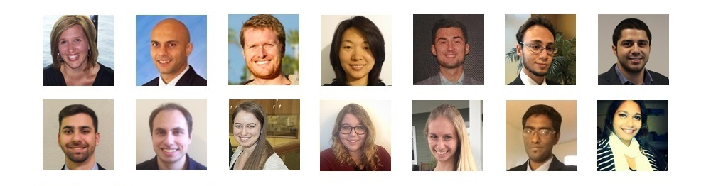

```{r setup, include=FALSE}
options(htmltools.dir.version = FALSE)
knitr::opts_chunk$set(echo = FALSE, results = "asis", fig.height = 7.5, fig.width = 10, fig.retina = 2)
library(tidyverse)
library(ap)

pkgs <- c("dplyr", "purrr", "stringr", "ggplot2", "simpleCache", "ap")
purrr::walk(pkgs, library, character.only = TRUE, warn.conflicts = FALSE, quietly = TRUE)

# source(here::here('analyses/informs2017/informs2017-1-exp.R'))
owd <- setwd("/Users/garrickaden-buie/Dropbox/USF/activityProfiles/analyses/informs2017/")
source("informs2017-1-exp.R")
setwd(owd)
results_ap <- results
```

```{r xaringan-themer, include=FALSE, cache=TRUE}
library(xaringanthemer)
usf_green <- "#006747"
usf_gold  <- "#CFC493"
usf_gray  <- "#7E96A0"
usf_accent <- c("#DBE442","#9CCB3B","#009374","#29AFCE","#80B0A6","#7396A0","#006484","#466069")
duo_accent(
  text_font_google                = google_font("Roboto", "400", "300"),
  header_font_google              = google_font("Merriweather", "400", "300", "300i"),
  code_font_google                = google_font("IBM Plex Mono"),
  text_font_weight                = "400",
  text_font_size                  = "23px",
  code_inline_color               = "#222",
  text_slide_number_color         = usf_gray,
  inverse_header_color            = "#FFF",
  inverse_background_color        = usf_green,
  table_row_even_background_color = apply_alpha(usf_gold, 0.25),
  title_slide_background_image    = "images/usf-logo-gold.png",
  title_slide_background_size     = "200px",
  title_slide_background_position = "90% 90%",
  extra_css = list(
    ".remark-notes-area .remark-bottom-area .remark-notes-current-area" = 
      list(height = "80%"),
    ".remark-slide-content" = list(
      "padding-top"    = "0px",
      "padding-bottom" = "0px"),
    ".title-slide > h3" = list(
      "text-align"  = "left",
      "font-size"   = "25px",
      "font-weight" = "300"), 
    ".title-slide h2" = list(
      "font-size"     = "30px",
      "font-weight"   = "300",
      "margin-bottom" = "5.5em"),
    ".title-slide h3" = list("margin" = "10px"),
    ".huge"           = list("font-size" = "3em"),
    ".bigger"         = list("font-size" = "40px"),
    ".big"            = list("font-size" = "1.5em"),
    ".white"          = list(color = "#FFF"),
    ".skip-header"    = list("margin-top" = "33%"),
    ".mt-3"           = list("margin-top" = "3em"),
    ".hl"             = list("background-color" = "#ffff88 !important"),
    ".hl-text"        = list("color" = "#BB1847"),
    ".ngram-example code" = list(
      "font-size" = "1.5em",
      "word-wrap" = "break-word",
      color       = "#555"),
    "ul.words" = list("list-style" = "none"),
    ".words li, .word" = list(
      "font-family"      = "IBM Plex Mono, Monaco, monospace",
      "background-color" = "#eee",
      "padding-left"     = "8px",
      "padding-right"    = "8px",
      "margin-bottom"    = "6px",
      "width"            = "275px",
      "white-space"      = "nowrap",
      "border"           = "1px #aaa solid"),
    "li" = list("margin-bottom" = "0.4em"),
    ".box-light" = list(
      background      = "rgba(255,255,255,0.85)",
      "border-radius" = "2px",
      display         = "inline-block",
      width           = "75%",
      margin          = "1rem",
      position        = "relative",
      "box-shadow"    = "0 19px 38px rgba(0,0,0,0.30), 0 15px 12px rgba(0,0,0,0.22)",
      "padding"       = "1em 1em 1em 2em"),
    "#table-results td, #table-results th" = list(
      "padding-left"  = "13px",
      "padding-right" = "13px"),
    ".bg-darken" = list(
      "background-color" = "#00000040",
      "padding"          = "10px"),
    ".bg-lighten" = list(
      "background-color" = "#FFFFFF70",
      "padding"          = "15px")
  )
)
```
class: middle
exclude: true

<!-- LINKS 
[isg-2018]: https://www.sfu.ca/fc/ISG2018/
[xaringan]: https://github.com/yihui/xaringan
-->


## Outline

1. Introduction
    - CREATE Health
    - HomeSense

1. Activity Profiles

1. Behavior Change Detection

---
exclude: true

## Overview

1. Intro
    - Our study focuses on addressing X (one slide)
    - Study participants (one slide)
    - Research objective
1. System
    - Sensors, placement, etc.
1. Activity Profiles
    - Day-event sequences and bag-of-event *n*-grams
    - How are APs compared?
    - Occupant identification task: experiment and results
1. Behavior Change Detection

---
background-image: url(images/createhealthlogo.png)
background-size: 66%
background-position: 50% 5%
class: bottom, center

.big[
<br><br>
`usf.edu/engineering/create-health`<br><br>
]

???

CREATE Health 
- is an **interdisciplinary team** 
- of ENG & PUB HEALTH students & researchers
- dedicated to improving the health and quality of life of aging populations
- through the use of technology

CH's research focuses on 
- alleviating the burdens, financial and physical, of chronic disease treatment 
- by examining how technology can improve healthcare delivery and support, 
- in particular at the intersection of community and organizational health system components.

---
background-image: url(images/homesense-over-shoulder3.jpg)
background-size: 100%
background-position: 50% 160%

## HomeSense

- Unobtrusive wireless sensors
- Central data collection and processing
- System and inventory management backend
- Website for study participants and family

???

Today's talk will focus on a central component of CH's research: *HomeSense*.

HomeSense is 
- a wireless sensor system developed by our team
- with the goal of monitoring of daily activities
- and with a particular focus on activities that signal health changes or influence health outcomes

The main compenents of the system are
- wireless sensors installed throughout the home
    - **presence**: PIR motion sensors in all commonly used areas
    - **magnetic contact sensors**: doors, cabinets, fridge access
    - **other**: electricity, temp, luminance, etc.
- the data is collected through raspberry pi in home<br>
  collected, warehoused and processed on our servers
- Internally managed with a number of dashboards and<br>
  custom inventory management systems
- Summarized data presented to users and family/friends<br>
  via web interface

---
class: bottom center
background-image: url(images/woman-seated-patio-1500.jpg)
background-size: 100%
background-position: top left
layout: true
---
.big[_I like the idea that my kids feel really secure, knowing that I’m on the other side of the country._]

???

The greatest .big[value proposition] of this technology <br>
was summarized perfectly by one of our participants,<br>
who described their experience with HomeSense, saying...


---
count:false
.big[_This is a great non-intrusive system that makes me at ease, makes my family and I feel more safe and connected._]

---
layout:false
background-image: url(images/villages-flyover.png)
background-height: 100%
class: bottom, center
exclude: true

.box-light[
### The Villages, FL

.left[
- Something

- Something

- Something
]]
<div style="padding: 15px">&nbsp;</div>

---
layout: false

### Lifestyle Reassurance

- Alleviate burden of chronic illness on older adults and their informal caregivers through supportive technology

- Provides safety and security by alerting adults and their caregivers to changes in routine

???

This need for safe aging in place is reflected in our design goal
of supporting **lifestyle reassurance**.

Our objective is to use supporting technologies such as HomeSense to
alleviate the burden of chronic illness on OA & CGs

To that end we want to support safety and security by noticing changes
in behavior and routine and alerting OA/CGs when these occur

--

### Unsupervised Behavior Change Detection

- Labelled activity data is difficult and expensive to collect

- Requires solutions without explicit, higher-level activity labels

- Reflects real-world, natural, smart home activity data

???
<hr>

OTOH, because labelled activity data 
is difficult and expensive to collect –<br>
especially natural patterns of Daily Living –<br>
we need an approach that does not require
explicit, high-level activity labels
and that can effectively make use of real-world, natural SH act. data

---
class: inverse middle

## Research Objective

.bigger.white[
_Can we effectively use<br>
passively-recorded<br>
unlabelled sensor data<br>
to characterize lifestyle<br>
activity patterns and enable<br>
detection of changes in routine?_
]

???

To summarize, our research objective is centered on the question...

We will address this question from two angles:

1. Defining *lifestyle activity pattern*

2. Using the AP for behavior change detection

---
## Outline

.big[
1. Data Collection and Processing

2. Activity Profiles

3. Behavior Change Detection
]

???

Over the next few slides, we'll touch briefly on<br>
the sensor system and the data that we collected<br>

Then I'll lay out our definition of *activity profiles*
and present the results of an experiment to demonstrate
that the activity profile captures the unique behavior 
of the occupant.

Finally, we'll discuss the method and results of the 
algorithm for behavior change detection.

---
## Data Collection

**HomeSense** was installed in the homes of
- community-dwelling older adults in The Villages, FL
- who live alone and were of good health

Bi-weekly phone survey tracks occurrence of health changes

???

Read slides...

14 participants, aged 68+

--

### Data Selection for Activity Profiles

Selected 6 participants who completed at least 196 days

- Excluding vacation, maintenance visits, guests & visitors

Each of the homes have similar floorplan & sensor layout

???

Because sensor installations varied according to floorplan
we selected a subset of participants with longterm participation
and identical sensor layouts.

---
background-image: url(images/simple-exp-covered.png)
background-size: 96%
background-position: 20% 50%

## Floorplan and Sensor Layout

???

Included in the sensor network
- motion sensors for the generalized detection
of presence throughout the home
- magnetic contact sensors for detection of
interaction with entrance and exit doors and routinely used objects
- wireless, z-wave

---
layout: true
## Activity Profiles
---

Represent sensor events as daily *event sequences*

1. Use only **active** sensor firings grouped by day

1. Day begins at first 5 active events after 4 a.m.

1. Insert *pause event* when no activity in 15 minutes

1. Summarize event sequence as **bag-of-event _n_-grams**

---

```{r ngram-example-1}
example_sequence <- "IiIAEFfFfA0AE0EGAgEAIiIAEIiIiOiIGAgEIIIAE0AE0AEAAE0A0AAEIiIFfFfAEA0AEAE0AEEAAEAEAA0AIiI0AEIiI0IIiI0"
example_sequence <- "IiIAEFfFf0AE0AIiiOIiIA0AEGg0GAgEIiIA0AEAA0A0AGgE0A0AEAEA0AFfIiIIEAFGgAf0FfAIiIA0AE0AEIiII0IiI0"

# TODO: highligh letters as unencoded event appears
cat(".ngram-example[", "<code>", example_sequence, "</code>", "]", sep="\n")
```

--

```{r ngram-example-2}
dict <- dat$House003$dictionary
dict <- c(dict, "Pause" = "0")
example_actual <- ap:::decode(str_split(example_sequence, "")[[1]], dict)
example_actual <- str_replace(example_actual, "!Opened", "Closed")
example_actual <- str_replace_all(example_actual, "(\\w)([A-Z])", "\\1 \\2")
# cat('<ul class="words">',
#     paste0("<li>", example_actual[1:10], "</li>"),
#     "</ul>"
# )
cat('<p style="line-height: 2.5em">', 
    paste0('<span class="word">', example_actual[1:10], "</span>", 
           c(rep("\n--\n", 5), rep("", 5)), 
           collapse = " \U27A1 "),
    "</p>")
```

---

```{r ngram-example-sliding}
length_ngram <- 5
ngrams <- c()
for (i in 1:7) {
  ngram <- substr(example_sequence, i, i+length_ngram-1)
  ngrams <- c(ngrams, ngram)
  cat(sep = "",
    ".ngram-example[\n<code>",
    substr(example_sequence, 0, i-1),
    ".word.hl-text.hl[",
    ngram,
    "]",
    substr(example_sequence, i+length_ngram, nchar(example_sequence)),
    "</code>\n]", 
    if (i == 1) "\n\n--\n\n",
    "&nbsp;&nbsp;&nbsp;&nbsp;.big[\U2B07]",
    if (i == 1) "\n\n--\n\n",
    if (length(ngrams)) paste0("\n\n**Bag of event n-grams**\n\n.word[", paste(ngrams, collapse = "] .word["), "]"),
    # if (length(ngrams)) paste0("\n\n**Bag of n-grams:**\n\n<ul class=\"words\"><li>", paste(ngrams, collapse = "</li><li>"), "</ul>"),
    "\n\n---\ncount: false\n\n")
}
```

.pull-left[
**Bag-of-event n-grams**

- Repeat process for $n$ from `r NGRAM_MIN` to `r NGRAM_MAX`

- Calculate relative frequency $p$ of each $n$-gram

- Can be used to summarize $m$ days

**Compare two profiles**

- Using Kullback-Leibler Symmetric Distance
]

.pull-right[
```{r ngrams-table}
ngramify_freq(example_sequence, NGRAM_MIN, NGRAM_MAX) %>% 
  mutate(ngram = glue::glue("<span class='word'>{ngram}</span>")) %>% 
  slice(1:10) %>% 
  knitr::kable(format = "html", digits = 4, escape = FALSE,
               align = "cccr",
               col.names = c("n-gram", "Count", "Rank", "Freq."))
```
]

???

KL Distance provides a distance measure between probability distributions.

We use KL dist to compare frequencies across b-o-e n-grams (activity profiles)

---
layout: true
## Evaluating Activity Profiles
---

*Do activity profiles capture the occupant's unique patterns?*

--

**Reframe as supervised learning**

*Can we identify the correct occupant for a de-identified day of activity?*

???

Also: If we're creating a baseline profile, how many days are needed?

--

**Experimental Setup**

- 7-fold cross validation
    - Test on each of **28 testing days**
    - Profiles drawn from remaining **168 training days**
  
- Baseline N-day activity profile for each occupant
    - N — 14 days to 3 months
    
- Measure ability to correctly identify occupant of test day

???

Note, because profiles drawn from 168 training days, 
I repeatedly draw from training pool so that all folds
have 12 trial total (12 iters, 1 rep -- 2 iters, 6 reps)

---
layout:true

## Results: Activity Profiles

```{r results-ap-table}
day_names <- colnames(results_ap$summary_overall_final)[-1]
day_names <- sub(" ", "<br>", day_names)
results_ap$summary_overall_final %>% 
  mutate_if(is.numeric, function(x) {
    x <- sprintf("%0.3f", x)
    paste0(
      '<span style="color: #555;">',
      substr(x, 1, 3), 
      "</span><span style=\"font-weight: normal\">", 
      substr(x, 4, 5), 
      "</span>")
  }) %>% 
  column_to_rownames("metric") %>% 
  knitr::kable(
    format="html",
    col.names = day_names,
    align = "r",
    table.attr = 'id="table-results"',
    escape = FALSE)
```
<br>

---

--

```{r results-ap, fig.height=3.5}
results_ap$summary_overall %>% 
  filter(metric == "f1") %>%
  group_by(metric, model) %>%
  summarize(value = mean(value)) %>%
  ungroup() %>%
  mutate(
    days = str_replace(model, "days", ""),
    days = as.integer(days),
    metric = "F-Measure"
  ) %>% 
  {
    ggplot(.) +
      aes(x = days, y = value) + 
      geom_point(size = 3, color = usf_green) +
      geom_line(size = 1.25, alpha = 0.5, color = usf_green) +
      guides(color = FALSE) +
      ylim(0.85, 1) +
      scale_x_continuous(
        breaks = seq(14, 84, 14),
        minor_breaks = seq(14, 84, 7)) +
      labs(x = "Days in Profile", y = "F-Measure") +
      theme_minimal(20, "Roboto") +
      theme(
        panel.grid.minor.y = element_blank())
  }
```

---
count: false

```{r results-ap-ungrouped, fig.height=3.5}
g <- results_ap$summary_overall %>% 
  filter(metric == "f1") %>%
  # group_by(metric, model) %>% 
  # summarize(value = mean(value)) %>% 
  # ungroup() %>% 
  mutate(
    days = str_replace(model, "days", ""),
    days = as.integer(days),
    metric = "F-Measure"
  ) %>% 
  {
    ggplot(.) +
      aes(x = days, y = value, color = house_name) + 
      geom_point(size = 2.) +
      geom_line(size = 1.25, alpha = 0.5) +
      guides(color = FALSE) +
      ylim(0.85, 1) +
      scale_color_manual(values = usf_accent[-1])+
      scale_x_continuous(
        breaks = seq(14, 84, 14),
        minor_breaks = seq(14, 84, 7)) +
      labs(x = "Days in Profile", y = "F-Measure") +
      theme_minimal(20, "Roboto") +
      theme(
        panel.grid.minor.y = element_blank())
  }
g
```

---
count: false

```{r results-ap-sel, fig.height=3.5}
g + annotate("rect", xmin = 39, xmax = 45, ymin=-Inf, ymax=Inf, fill = usf_gray, alpha = 0.3)
```

???

Note 42d (6w) maximizes performance across the board

Plotting **F Measure** (F1): balance of precision and recall

(balanced measure of binary classification)

28-42 days ok (4, 6 wk)

---
layout: true
## WIP: Behavior Change Detection
---

1. Builds on AP experiment, but comparing occupant to self

1. Permutation-based methods for change detection
    - What is normal variation vs. anomaly/change?
    
1. Baseline vs. sliding window

1. Goal: Sensitivity over specificity

???

Notes

---

- bag of event *n*-grams method was first validated as a supervised
classification problem
    - activity profiles were used to identify occupants from 6 homes with identical layouts
    - Activity profiles based on 4 and 6 weeks of activity led to correct identification of a given occupant for unlabelled days of activity with high accuracy
    
- unsupervised behavior change was applied to the activity data from four participants
    - over a period of one year (one participant) or two years (three participants)
    - who reported health changes ranging from acute episodes of illness to mobility restrictions leading to major surgery

- Comparison of activity profiles over time windows of 1 to 4 weeks reliably detects major shifts in behavior

???

Points pulled from abstract
